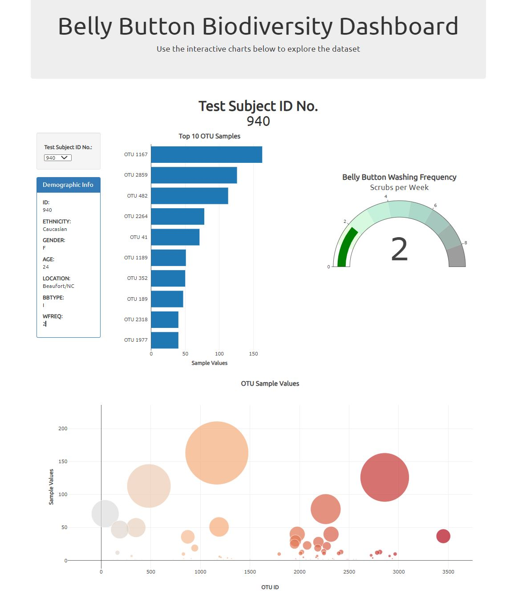

# Plot.ly - Belly Button Biodiversity
In this project a interactive dashboard was created to explore  [Belly Button Biodiversity dataset](http://robdunnlab.com/projects/belly-button-biodiversity/), which catelogs the micrones that colonise human navels.The dataset reveals that a small handful of microbial species (also called operational taxonomic units, or OTUs, in the study) were present in more than 70% of people, while the rest were relatively rare. The dashboard utilises webage writen in HTML and the D3 library to read data in to create a dropdown menu to display a chart of each sample Plotly. The link to the site:
## Link to site
https://tomjp90.github.io/plotly-challenge/index

If the repositry is cloned, please activate a python local server in a terminal "python -m http.server" and navigate in a web browser (http://localhost:8000/) to the index.html.

## Tehnologies used:
* JavaScript
* D3 Library
* Plot.ly
* HTML
* CSS

## Step 1: Plotly

1. Use the D3 library to read in `samples.json`.

2. Create a horizontal bar chart with a dropdown menu to display the top 10 OTUs found in that individual.

* Use `sample_values` as the values for the bar chart.

* Use `otu_ids` as the labels for the bar chart.

* Use `otu_labels` as the hovertext for the chart.

3. Create a bubble chart that displays each sample.

* Use `otu_ids` for the x values.

* Use `sample_values` for the y values.

* Use `sample_values` for the marker size.

* Use `otu_ids` for the marker colors.

* Use `otu_labels` for the text values.

4. Display the sample metadata, i.e., an individual's demographic information.

5. Display each key-value pair from the metadata JSON object somewhere on the page.

6. Update all of the plots any time that a new sample is selected.

## Advanced Challenge Assignment 

The following task is advanced and therefore optional.

* Adapt the Gauge Chart from <https://plot.ly/javascript/gauge-charts/> to plot the weekly washing frequency of the individual.

* You will need to modify the example gauge code to account for values ranging from 0 through 9.

* Update the chart whenever a new sample is selected.

### About the Data

Hulcr, J. et al.(2012) _A Jungle in There: Bacteria in Belly Buttons are Highly Diverse, but Predictable_. Retrieved from: [http://robdunnlab.com/projects/belly-button-biodiversity/results-and-data/](http://robdunnlab.com/projects/belly-button-biodiversity/results-and-data/)
